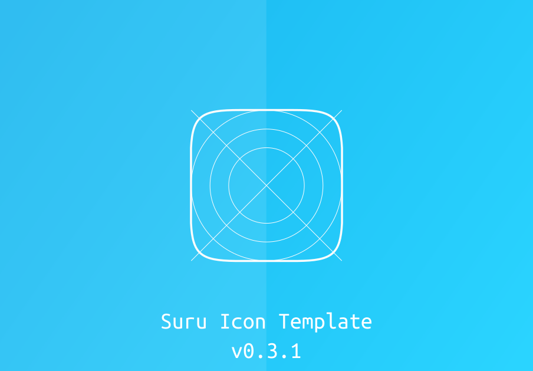
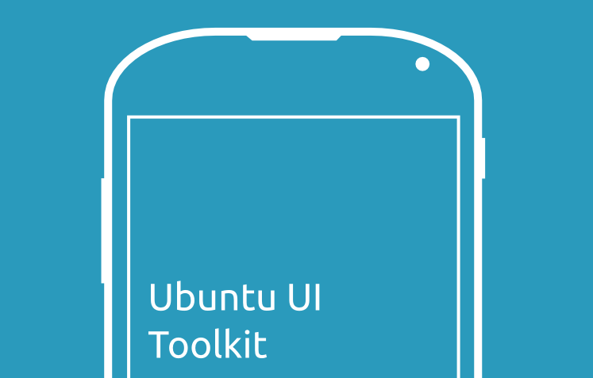

# Suru Icon Template kit
Everything you need to create a consistent icon for the Ubuntu phone. Complete paper texture and various paper folds. Pictogram break shape break down icon margins. Please also take a look the offical Ubuntu icon guidelines at https://design.ubuntu.com/apps/style/iconography

# Ubuntu-UI-Tookit
A collection of svg images in one file that allows developers to quickly draft and mock up layouts for the Ubuntu phone. Based on the [ucdk by Lucas Romero Di Benedeto](https://github.com/lucasromerodb/ucdk). But with update ui elements from the Ubuntu sdk 14.10 and 15.04. 

